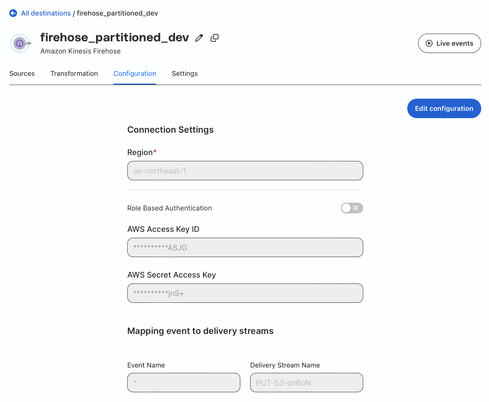
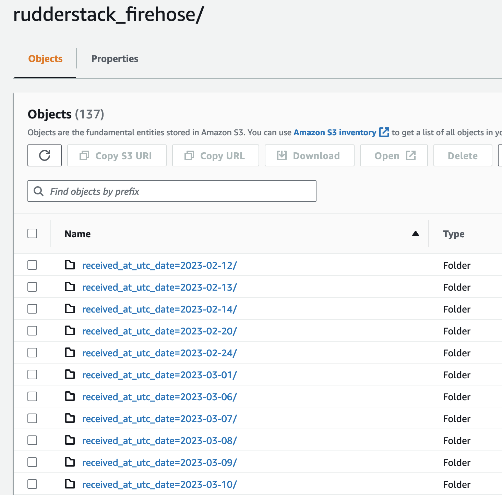
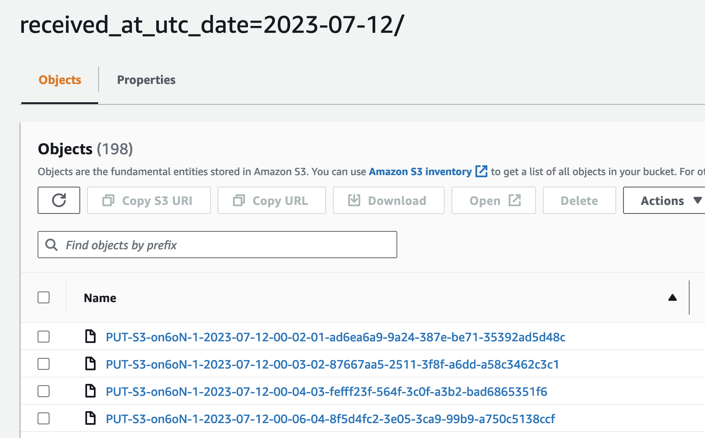

# Setup Kinesis Firehose

## Create Kinesis Firehose

Open Amazon CloudFormation service console, and then create a stack by uploading the JSON template.

Next, specify the bucket name for storing the event data files and stream name of the Kinesis Firehose.


## Configuring Kinesis Firehose destination in RudderStack

In the IAM service under the AWS Console, create an IAM Policy with the Name "rudder-firehose-put-policy". Replace the bold sections with your own region and Account ID.

```
{
    "Version": "2012-10-17",
    "Statement": [
        {
            "Sid": "VisualEditor0",
            "Effect": "Allow",
            "Action": "firehose:PutRecord",
            "Resource": "arn:aws:firehose:<aws-region>:<your-aws-account-id>:deliverystream/*"
        }
    ]
}
```
Replace the placeholder <> with real value.

Create another IAM user with the Name "rudder-server" and attach the above Policy. Under the user's Security credentials, create a new Access Key and securely save the Access Key and Secret Key as they will be used later.

Go to the RudderStack Control Panel and navigate to the Overview of the Shopify Source. 

Click the "Add Destination" button to create a new Destination. 

Search for "Firehose" and select "Amazon Kinesis Firehose" under Cloud Destinations. 

Enter the Destination Name, Region, uncheck the "Role Based Authentication" option, and provide the Access Key and Secret Key of the IAM user created earlier. 

Set the Event Name to "*", and enter the name of the previously created Kinesis Firehose in the Delivery Stream Name field.

No configuration is needed for Transformation. Click "Save".



Finally, in the Connections section of the Control Panel, you can see that the Shopify Source and Firehose Destinations are connected.


## To check the output of Firehose to S3 and perform table queries

Open the S3 Console and select the S3 bucket associated with the Firehose destination. In the corresponding path, you will find data partitioned by day:




Open the Athena Console and execute the following SQL statements in the query interface:

```sql
create database rudderstack;
```

After selecting the rudderstack database, execute the following SQL statement, replacing the bold parts:

```sql
-- Replace <s3_bucket_name> with the corresponding S3 bucket name

CREATE EXTERNAL TABLE IF NOT EXISTS rudderstack_rawevents_part (
  `anonymousid` string COMMENT 'from deserializer', 
  `channel` string COMMENT 'from deserializer', 
  `context` map<string,string> COMMENT 'from deserializer', 
  `integrations` struct<all:boolean> COMMENT 'from deserializer', 
  `messageid` string COMMENT 'from deserializer', 
  `originaltimestamp` string COMMENT 'from deserializer', 
  `properties` map<string,string> COMMENT 'from deserializer', 
  `receivedat` string COMMENT 'from deserializer', 
  `request_ip` string COMMENT 'from deserializer', 
  `rudderid` string COMMENT 'from deserializer', 
  `sentat` string COMMENT 'from deserializer', 
  `timestamp` string COMMENT 'from deserializer', 
  `type` string COMMENT 'from deserializer', 
  `userid` string COMMENT 'from deserializer', 
  `event` string COMMENT 'from deserializer', 
  `traits` map<string,string> COMMENT 'from deserializer'
)
PARTITIONED BY (`received_at_utc_date` string)
ROW FORMAT SERDE 
  'org.openx.data.jsonserde.JsonSerDe' 
WITH SERDEPROPERTIES ( 
  'paths'='anonymousId,channel,context,integrations,messageId,originalTimestamp,properties,receivedAt,request_ip,rudderId,sentAt,timestamp,type,userId,event,traits') 
STORED AS INPUTFORMAT 
  'org.apache.hadoop.mapred.TextInputFormat' 
OUTPUTFORMAT 
  'org.apache.hadoop.hive.ql.io.HiveIgnoreKeyTextOutputFormat'
LOCATION 's3://<s3_bucket_path>/rudderstack_firehose'
;

```
After executing the above SQL statement, click the button next to the table name and select "Load partitions" from the pop-up menu to load all existing partitions.

Finally, you can query all event data in Athena.

```sql
select * from rudderstack_rawevents_part limit 100;
```