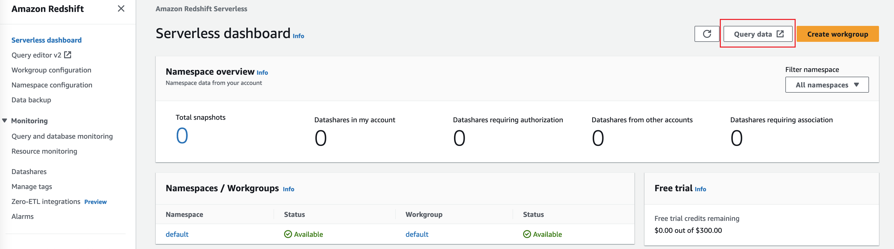
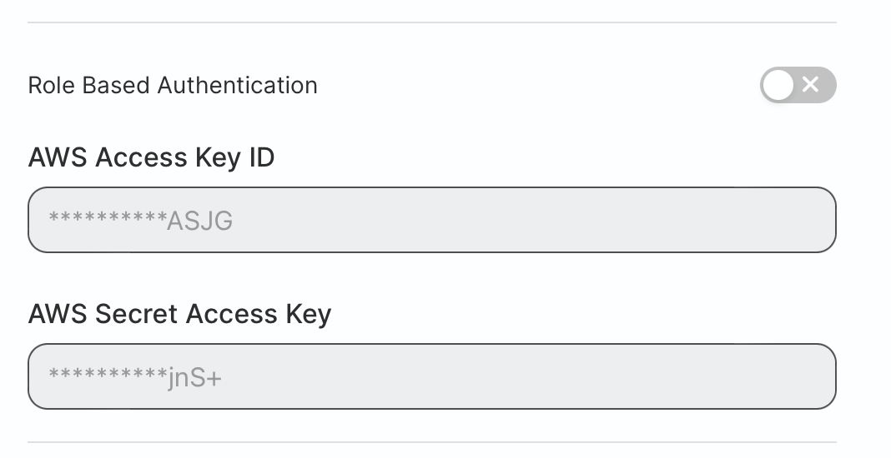
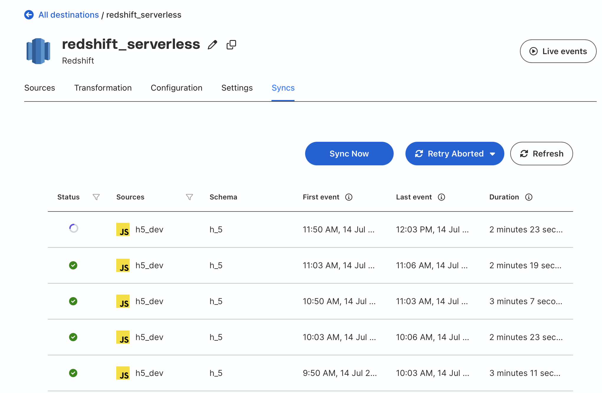

# Setup Redshift Destination

## Prerequisites

A redshift cluster (provisioned or serverless) is ready. If the cluster is created in private subnet, it should be located in the Same VPC as the rudderstack data plane service.

For Amazon Redshift cluster creation, please refer to [RudderStack Docs](https://www.rudderstack.com/docs/destinations/warehouse-destinations/redshift/) or [AWS Docs](https://docs.aws.amazon.com/redshift/latest/gsg/new-user-serverless.html#serverless-console-resource-creation) for a serverless cluster.

## Setting user permissions in Amazon Redshift

This section contains the steps to create a new user to access the Redshift cluster and create temporary tables in it.


1. Open the Redshift Query Editor v2 in Redshift Console.

    

2. Run queries to create a new user:

    ```sql
    -- create a user named "rudder" RudderStack can use to access Redshift
    CREATE USER rudder PASSWORD '<password goes here>';

    -- granting schema creation permission to the "rudder" user on the database you chose earlier
    GRANT CREATE ON DATABASE "<database name goes here>" TO "rudder";
    ```

3. Modify the security group of the Redshift cluster to enable RudderStack Data Plane to access the Redshift.

    1. Find the security group ID of the Amazon EKS work node in EC2 Console. (e.g. sg-xxxx5adbe1429xxxx)

    2. Edit the security group of the Redshift cluster, add a new inbound rule: Port: 5439, Source: security group id in previous step, Descrption: Rudderstack Data Plane

## Configuring Redshift destination in RudderStack

To send event data to Redshift, you first need to add it as a destination in RudderStack and connect it to your data source. Once the destination is enabled, events will automatically start flowing to Redshift via RudderStack.

To configure Redshift as a destination in RudderStack, follow these steps:

1. In your RudderStack dashboard, set up the data source. Then, select Redshift from the list of destinations.

2. Assign a name to your destination and then click Next.

### Connection settings

    - **Host**: The host name of your Redshift service.
    - **Port**: The port number associated with the Redshift database instance.
    - **Database**: The database name in your Redshift instance where the data will be sent.
    - **User**: The name of the user with the required read/write access to the above database, the default value is *rudder*.
    - **Password**: The password for the above user.
    - **Namespace**: Enter the schema name where RudderStack will create all tables. If you don’t specify any namespace, RudderStack will set this to the source name, by default.

### Sync settings
    - **Sync Frequency**: Specify how often RudderStack should sync the data to your Redshift database. The default value is 'Every 30 minutes'.


### Configuring the object storage 
RudderStack lets you configure the following object storage configuration settings while setting up your Redshift destination:

    - **Staging S3 Storage Bucket Name**: enter a S3 bucket name for the staging files which will be copied into Redshift. The default value is *rudderstack-staging-bucket-<your-account-id>*.

#### Setup S3 Permissions

1. create IAM policy with the following JSON:
    ```
    {
    "Version": "2012-10-17",
    "Statement": [
        {
        "Effect": "Allow",
        "Action": [
            "s3:GetObject",
            "s3:PutObject",
            "s3:PutObjectAcl",
            "s3:ListBucket"
        ],
        "Resource": [
            "arn:aws:s3:::YOUR_BUCKET_NAME/*",
            "arn:aws:s3:::YOUR_BUCKET_NAME"
        ]
        }
    ]
    }
    ```
    The default YOUR_BUCKET_NAME is *rudderstack-staging-bucket-<your-account-id>*.

2. Create an IAM user *rudder-server* with programmatic access keys and attach the above created IAM policy. 

3. Make sure the Redshift attached IAM roles have enough permissions to read the bucket and the files in the bucket.

    If the IAM role permission is not set, create a policy with the following JSON and attach the Redshift's IAM role:
    ```
    {
        "Version": "2012-10-17",
        "Statement": [
            {
                "Action": [
                    "s3:GetObject",
                    "s3:GetBucketAcl",
                    "s3:GetBucketCors",
                    "s3:GetEncryptionConfiguration",
                    "s3:GetBucketLocation",
                    "s3:ListBucket",
                    "s3:ListAllMyBuckets",
                    "s3:ListMultipartUploadParts",
                    "s3:ListBucketMultipartUploads",
                    "s3:PutObject",
                    "s3:PutBucketAcl",
                    "s3:PutBucketCors",
                    "s3:DeleteObject",
                    "s3:AbortMultipartUpload",
                    "s3:CreateBucket"
                ],
                "Effect": "Allow",
                "Resource": "arn:aws:s3:::*"
            }
        ]
    }
    ```

#### Setup Access Key and Secret Key



Disable Role Based Authentication.

    - **AWS Access Key ID**: The IAM user *rudder-server*'s Access Key.
    - **AWS Secret Access Key**: The secret key for the IAM user.

## Check Syncs Tabs

After completing the setup of the Redshift Destination, please check the sync tabs to make sure the sync process is successful.



## Reference

[Rudderstack Docs](https://www.rudderstack.com/docs/destinations/warehouse-destinations/redshift/)