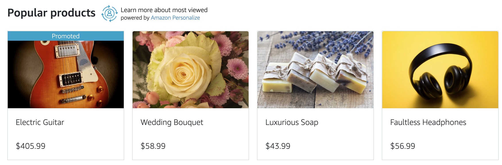
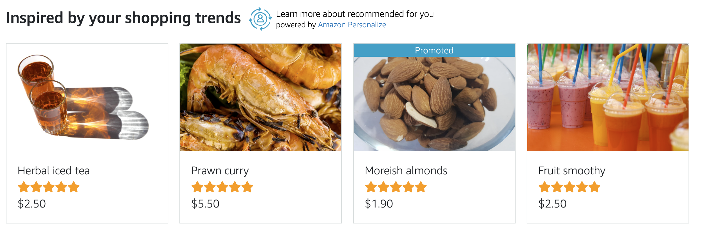
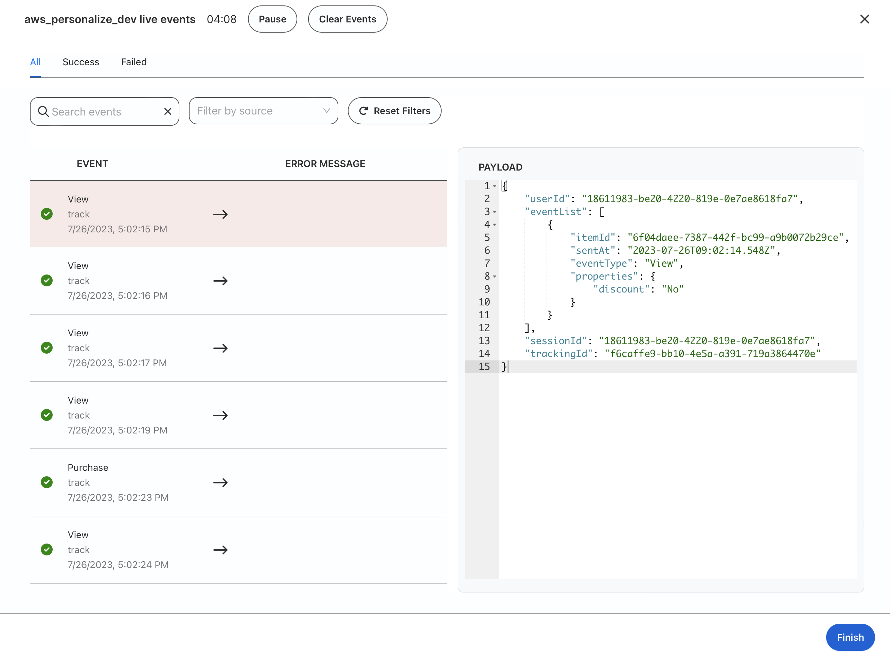
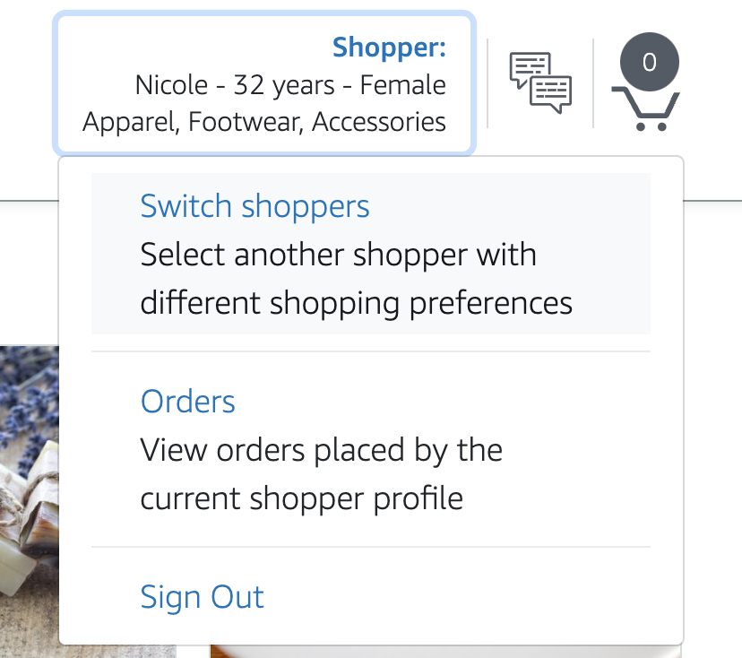
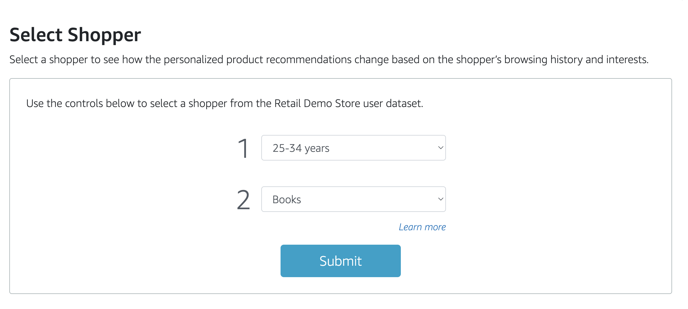

# Personalized Recommendation: Integrating RudderStack and Amazon Personalize

English | [中文](README_CN.md)

Please follow the steps below to configure the Amazon Personalize service and RudderStack, and experience real-time personalized product recommendations in the Retail Demo Store.

0. Configure Amazon Personalize service

   Execute the code in the [Prepare-Personalize-and-import-data notebook](Prepare-Personalize-and-import-data.ipynb) in order, to create a Dataset Group, Dataset, and Event Tracker.

1. Create a Destination in RudderStack's Control Plane.

   Select the Destinations menu on the left, click "New destination", enter "personalize" in the Search Destinations search box, and select AWS Personalize that appears below.

   Enter the name of the target in Name destination, such as aws_personalize_dev.

   In the "Connect Sources" step, select the JavaScript source created earlier in 1-DemoSource, and click the Continue button to proceed.

   In the "Configure" step, under "1. Connection Credentials", deselect the Role Based Authentication option.

   Enter the key pair generated in the Setup Access Key and Secret Key in step [2-DataCollection/RedshiftDestination](../2-DataCollection/RedshiftDestination/README.md) in Access Key Id and Secret Access Key.

   Fill in the Region with the region code where the Amazon Personalize service is located, preferably in the same region where the RudderStack Data Plane is deployed.

   Fill in the TrackingId under "2. Information on Dataset Group" with the Event Tracking ID generated in step 0. Fill in the Dataset ARN with the Dataset ARN created in step 0.

   Under "3. Operational Choice", select PutEvents in Personalize Events, and fill in Map all the fields with the following information:
   ```
   Schema Field   Mapped Field
   ---------------------------
   ITEM_ID        productid
   DISCOUNT       discount
   ```

   In the Transformation step, click "Create New Transformation", select Custom transformation, enter "filter" in Transformation name, copy the transformation.js code into the code editor,
   click the Continue button twice to complete the creation of the Destination.


2. Run the Retail Demo Store Web UI in [1-DemoSource](../1-DemoSource/).

   Popular products will be displayed for Guest users.
   
   
   Inspired by your shopping trends will be displayed for Logged in users.
   

   Open the RudderStack Control Plane, open the Live Events interface of the AWS Personalize Destination, then click on a product on the website to open the product details page, you can see similar events being sent to the Amazon Personalize service in real time.
   

   Observe the changes in the recommendation list by continuously browsing or purchasing products.

   You can also register an account first and then log in, and then simulate different user profiles by switching Persona from the upper right corner.
   

   