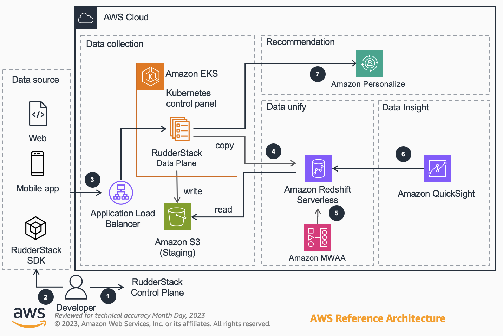

# Guidance for Digital Customer Engagement on AWS

## Introduction
This guidance helps businesses build a comprehensive digital customer engagement platform by leveraging RudderStack's warehouse-first CDP platform and AWS services such as Amazon Redshift, Amazon Athena, Amazon Pinpoint, and Amazon Quicksight. With RudderStack's platform, businesses can collect and store customer data from various sources, such as mobile apps and websites, and make it available for analysis and engagement. The guidance is designed to support various use cases, including Customer 360, personalized recommendation and advertisement attribution analysis.

## Prerequisites
1. Register in RudderStack control panel ([open source version](https://app.rudderstack.com/signup?type=opensource)) (not the cloud version).

2. You need the following to be installed on your local machine to access the Amazon EKS cluster
* [AWS CLI V2](https://docs.aws.amazon.com/cli/latest/userguide/install-cliv2.html)
* [AWS CDK](https://docs.aws.amazon.com/cdk/v2/guide/getting_started.html) 

## Architecture Diagram

### Use Redshift Destination

1. Developers configure data sources (Web, Mobile, Server), data destinations (Amazon Redshift), and connections in the Control Plane hosted by RudderStack.

2. Developers use the SDK provided by RudderStack's Event Stream to develop tracking for data sources, and after code deployment, track events are collected in real-time from websites, mobile apps, and backend services.

3. The SDK sends tracking events to Amazon ALB, which then enters the RudderStack Data Plane deployed on Amazon EKS. The Data Plane writes the events to the S3 Staging Folder, which is later imported into Redshift.

4. The RudderStack Data Plane periodically sends Copy commands, data merge SQL, and DDL to Redshift, importing the event data files from the S3 Staging Folder into Redshift tables.

5. Using Amazon Redshift and DBT, the event table is processed according to analysis requirements to create user behavior analysis detail tables, summary tables, and user profile tables. The task scheduling tool used is Apache Airflow.

6. Amazon QuickSight is used to create user behavior analysis dashboards, with the data source being the analysis summary table read through Amazon Redshift.

7. Import the User Profile table (unloaded from Redshift to S3) into Amazon Pinpoint as a User Segment, and utilize Amazon Pinpoint's built-in Segment and Campaign features to achieve user engagement.

8. The interaction data between Users and Items will be sent in real-time as events from the RudderStack Data Plane to the Amazon Personalize service. Based on different recommendation algorithms, corresponding recommendation results will be generated.

Included Modules:
   - 2-DataCollection/DataPlaneDeployment
   - 2-DataCollection/RedshiftDestination
   - 3-DataUnify/RedshiftTransformation

### Use Kinesis Firehose Destination

1. Developers configure data sources (Web, Mobile, Server), data destinations (Amazon Kinesis Firehose), and connections in the Control Plane hosted by RudderStack. 

2. With the SDK provided by RudderStack's Event Stream, developers can develop tracking for data sources, and after code deployment, collect tracking events in real-time from websites, mobile apps, and backend services.

3. The SDK sends tracking events to Amazon ALB, which then enters the RudderStack Data Plane deployed on Amazon EKS. The Data Plane forwards the events to Kinesis Firehose, which finally saves the tracking events in S3 according to the date received.

4. By creating an external table (in JSON format) in the Amazon Glue Data Catalog, with the table location pointing to the tracking event directory in S3, Amazon Athena can read and process the original tracking event table. The events are then written to different tables according to event type and event name, and Map-type fields are expanded for subsequent processing.

5. Amazon Athena is used to process the parsed event table according to analysis requirements, creating user behavior analysis detail tables, summary tables, and user profile tables. The task scheduling tool used is Apache Airflow.

6. Amazon QuickSight is used to create user behavior analysis dashboards, with the data source being the user behavior analysis summary table read through Amazon Athena.

7. Import the User Profile table into Amazon Pinpoint as a User Segment and utilize Amazon Pinpoint's built-in Segment and Campaign features to accomplish user engagement.

8. The interaction data between Users and Items will be sent in the form of events from the RudderStack Data Plane to the Amazon Personalize service in real-time. Based on different recommendation algorithms, corresponding recommendation results will be generated.

Included Modules:
   - 2-DataCollection/DataPlaneDeployment
   - 2-DataCollection/FirehoseDestination
   - 3-DataUnify/AthenaTransformation

## Modules

### 1-DemoSource

A retail store demo web UI with RudderStack JavaScript SDK integrated.

### 2-DataCollection/DataPlaneDeployment

A Comprehensive guide to deploying the RudderStack Data Plane service on Amazon EKS for production use.

### 2-DataCollection/RedshiftDestination

A Comprehensive guide to setup the Redshift Destination in RudderStack control plane and AWS Console.

### 2-DataCollection/FirehoseDestination

A Cloud Formation template for createing a Amazon Kinesis Firehose Delivery Stream to be used as RudderStack destination.

### 3-DataUnify/RedshiftTransformation

A DBT project designed to construct data models in Amazon Redshift, which can be utilized in Data Visualization services like Amazon Quicksight and Customer Engagement services such as Amazon Pinpoint.

### 3-DataUnify/AthenaTransformation

A Jupyter notebook that demonstrates the transformation of raw events data into curated data models.

### 4-Recommendation

This detailed guide on how to implement personalized recommendations specifically utilizes the integration of RudderStack and Amazon Personalize, achieving real-time event tracking to promptly respond to changes in user interests.

### 9-Tools/JSSourceDataGenerator

A Python script designed to send event requests, containing mock data, from a JavaScript source directly to the RudderStack Data Plane.

## Security

See [CONTRIBUTING](CONTRIBUTING.md#security-issue-notifications) for more information.

## License

This library is licensed under the MIT-0 License. See the LICENSE file.

